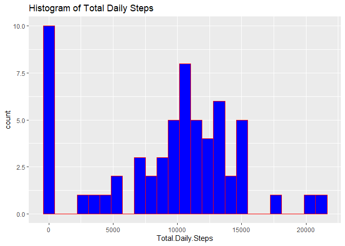
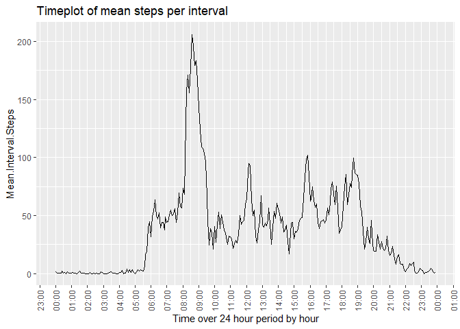
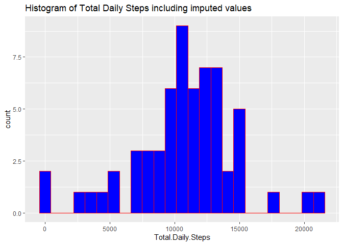
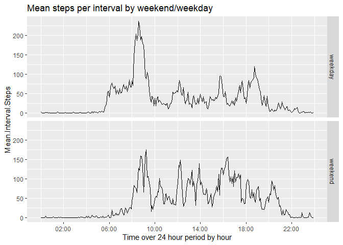

## Introduction

This assignment is part of the **Data Science Specialisation at John Hopkins University, Reproducible Research module Week 2 Assignment**.It provides for various data analysis on the activity undertaken by an individual over a period of time whilst wearing a personal activity monitoring device in which the person's activity measurements in the form of "Steps" have been recorded at 5 minute intervals.

The assignment should aim to address & answer a series of questions summarised below and should include both a series of computations on the activity, graphs of same and overall inclusion of the process pipeline, results and conclusion contained in a single encapsulating R Markdown document.

* Show Loading and preprocessing the data
* What is mean total number of steps taken per day?
* What is the average daily activity pattern?
* Approach to imputing missing values
* Are there differences in activity patterns between weekdays and weekends?

## Objective

The objective is to demonstrate the full end to end process from source, transformations & manipulations, analysis, results and conclusions to show a fully reproducible project.


## Data & Data Processing

### Data Description

This device collects data at 5 minute intervals through out the day. The data consists of two months of data from an anonymous individual collected during the months of October and November, 2012 and include the number of steps taken in 5 minute intervals each day.

The data for this assignment can be downloaded from the course web site see link in code except below.

The variables included in this dataset are:

* **steps**: Number of steps taking in a 5-minute interval (missing values are coded as NA
* **date**: The date on which the measurement was taken in YYYY-MM-DD format
* **interval**: Identifier for the 5-minute interval in which measurement was taken

The dataset is stored in a comma-separated-value (CSV) file and there are a total of 17,568 observations in this dataset.

### Loading & Pre-Processing the Data
The data file is initially read in from the URL, unzipped and read into a data frame, **activitydf**. Character dates are converted to Date format in new column **datefmt**.

Data type, summary stats and sample data displayed


### Figures

Any plots and figures used have been embedded in this single markdown document as part of the requirement for a single markdown document to cover all aspects of the project.

**Code to read and unzip the file with sample data**


```r
knitr::opts_chunk$set(echo = TRUE)

## Read the zip file
## Extract the comma delimited file
## Read the unzipped activity.csv file
temp <- tempfile()
download.file("https://d396qusza40orc.cloudfront.net/repdata%2Fdata%2Factivity.zip",temp,mode="wb")
unzfile <- unz(temp,"activity.csv")
activitydf<-read.csv(file=unzfile, sep = ",",header = TRUE, na.strings ="NA",stringsAsFactors= F,)

## Create a new data formatted column from date
activitydf$datefmt<-as.Date(activitydf$date, "%Y-%m-%d")

## Display data type and sample data
## Data Types etc
str(activitydf)
```

```
## 'data.frame':	17568 obs. of  4 variables:
##  $ steps   : int  NA NA NA NA NA NA NA NA NA NA ...
##  $ date    : chr  "2012-10-01" "2012-10-01" "2012-10-01" "2012-10-01" ...
##  $ interval: int  0 5 10 15 20 25 30 35 40 45 ...
##  $ datefmt : Date, format: "2012-10-01" "2012-10-01" ...
```

```r
## Sample of first 10 observations
head(activitydf, n=10)
```

```
##    steps       date interval    datefmt
## 1     NA 2012-10-01        0 2012-10-01
## 2     NA 2012-10-01        5 2012-10-01
## 3     NA 2012-10-01       10 2012-10-01
## 4     NA 2012-10-01       15 2012-10-01
## 5     NA 2012-10-01       20 2012-10-01
## 6     NA 2012-10-01       25 2012-10-01
## 7     NA 2012-10-01       30 2012-10-01
## 8     NA 2012-10-01       35 2012-10-01
## 9     NA 2012-10-01       40 2012-10-01
## 10    NA 2012-10-01       45 2012-10-01
```

**Install packages & library section**

```r
knitr::opts_chunk$set(echo = TRUE)
## install cran mirror as rmarkdown/rstudio does not default cran library when it is invoked 
install.packages("ggplot2",repos = c("http://cran.rstudio.com"))
```

```
## Installing package into 'C:/Users/Declan/Documents/R/win-library/3.6'
## (as 'lib' is unspecified)
```

```
## package 'ggplot2' successfully unpacked and MD5 sums checked
## 
## The downloaded binary packages are in
## 	C:\Users\Declan\AppData\Local\Temp\Rtmp8GzhAZ\downloaded_packages
```

```r
## Load ggplot2
library(ggplot2)
```

```
## Warning: package 'ggplot2' was built under R version 3.6.3
```

```r
## load ggplot2 scales for x-axis time plot
library(scales)
```

### What is mean total number of steps taken per day?
The data frame column **steps** is then summed by **date**fmt using the aggregate function and ouput assigned to a new data frame, **totbyday**, where the column names are adjusted in preparation for graphical output. Missing values are ignored.

Data type & sample data is displayed and the summary function call on the column **Total.Daily.Steps** will display and the **mean** and **median** values for that column as requested.

**Total Steps summed by Day**

```r
knitr::opts_chunk$set(echo = TRUE)

## Calculate total steps by day 
## Rename the column headings to reflect the summation
totbyday<-aggregate(activitydf$steps,by=list(activitydf$datefmt),FUN=sum,na.rm=TRUE)
names(totbyday)<-c("Date","Total.Daily.Steps")

## Display data types and sample data
str(totbyday)
```

```
## 'data.frame':	61 obs. of  2 variables:
##  $ Date             : Date, format: "2012-10-01" "2012-10-02" ...
##  $ Total.Daily.Steps: int  0 126 11352 12116 13294 15420 11015 0 12811 9900 ...
```

```r
## Summary output will display the mean and median values of the Total Daily Steps")
summary(totbyday$"Total.Daily.Steps")
```

```
##    Min. 1st Qu.  Median    Mean 3rd Qu.    Max. 
##       0    6778   10395    9354   12811   21194
```

```r
## Histogram of Total Daily Steps
ggplot(data=totbyday, aes(Total.Daily.Steps,fill=I("blue"),col=I("red")))+geom_histogram(bins=25)+ggtitle("Histogram of Total Daily Steps")
```

<!-- -->


### What is the average daily activity pattern?
In order to plot the average number of steps taken per 5 minute interval, the mean of data frame column **steps** is calculated by **interval** using the aggregate function and ouput assigned to a new data frame, **meanbyinterval**, where the column names are adjusted in preparation for graphical output.
Missing values are ignored.

Data type & sample data is displayed using str and a timeplot of average steps per interval displayed.

The interval with the maxium average number of steps is extracted based on the maximum value of **Mean.Interval.Steps**

**Average Steps per interval**

```r
knitr::opts_chunk$set(echo = TRUE)

## Calculate mean number of steps per 5 minute interval 
## Update column names 
meanbyinterval<-aggregate(activitydf$steps,by=list(activitydf$interval),FUN=mean,na.rm=TRUE)
names(meanbyinterval)<-c("Interval","Mean.Interval.Steps")

## parse & split the interval in hours and minutes
## Add 0 prefix for those hours and minutes < 10
## Create a POSIXct datetime value, dtime, for use on the x-axis timeplot, select arbitary date which will be supressed by displaying only the time portion on the x-axis
meanbyinterval$HH<-floor(meanbyinterval$Interval/100)
meanbyinterval$MM<-meanbyinterval$Interval%%100
meanbyinterval[meanbyinterval$HH<10,]$HH <-as.character(paste0("0",meanbyinterval[meanbyinterval$HH<10,]$HH))
meanbyinterval[meanbyinterval$MM<10,]$MM <-as.character(paste0("0",meanbyinterval[meanbyinterval$MM<10,]$MM))
meanbyinterval$dtime<-as.POSIXct(paste0("2020-01-01"," ",meanbyinterval$HH,":",meanbyinterval$MM,":00"))

## Display data types etc
str(meanbyinterval)
```

```
## 'data.frame':	288 obs. of  5 variables:
##  $ Interval           : int  0 5 10 15 20 25 30 35 40 45 ...
##  $ Mean.Interval.Steps: num  1.717 0.3396 0.1321 0.1509 0.0755 ...
##  $ HH                 : chr  "00" "00" "00" "00" ...
##  $ MM                 : chr  "00" "05" "10" "15" ...
##  $ dtime              : POSIXct, format: "2020-01-01 00:00:00" "2020-01-01 00:05:00" ...
```

```r
## Timeplot of mean steps per interval
ggplot(meanbyinterval, aes(dtime,Mean.Interval.Steps))+ geom_line()+ xlab("Time over 24 hour period by hour")+
  scale_x_datetime(breaks = date_breaks("1 hour"),labels=date_format("%H:%M"))+
  ggtitle("Timeplot of mean steps per interval")+ theme(axis.text.x = element_text(angle = 90, vjust = 0.5))
```

<!-- -->

```r
## Interval with the maximum number of mean steps      
print(paste0("5 minute interval with the max mean steps: ",
             meanbyinterval$Interval[meanbyinterval$Mean.Interval.Steps==max(meanbyinterval$Mean.Interval.Steps)]))
```

```
## [1] "5 minute interval with the max mean steps: 835"
```

### Strategy for imputed missing **step** values
Having performed an initial analysis of the **activity** dataset there are a significant number of missing values for **steps** data for multiple dates. This may well have an impact on the computed values and introduce bias within the results.

A strategy is required to estimate what values these missing values might have taken given the rest of the data. 
Options included:

*  Listwise deletion - discounted as missing values would be deleted defeating the purpose of the requirement
*  Mean Substition for that day - discounted as some days values were completely missing
*  Mean Substition for that interval - discounted as may introduce weekday/weekend bias

In the end a strategy of **Mean Substitution by weekday and interval** was considered to give the most accurate estimate for the missing steps based on the assumption the the User was a likely member of the “quantified self” movement and a creature of habit exercising regularly and where the missing values
could be down to exception rather than the rule. It assumes that some exrecise would have been performed on those days if they had been performed throughout the period for the same days of the week and intervals.

A second reason was based on the final requirement of the project that asked to consider the different between weekday and weekend impact on the data.

The imputation process is highlighted in the code below and the imputed **activity** data set consisting of the replaced missing values, **imputeda** data is created. The column **steps** in this data frame is then summed by **date**fmt using the aggregate function and ouput assigned to a new data frame **itotbyday**, for totaled imputed activity data set. The column names are adjusted in preparation for graphical output. Missing values are imputed in this case unlike in requirement one above where they have been ignored.

Data type & sample data is displayed and the summary function call on the column **Total.Daily.Steps** will display and the **mean** and **median** values for that column as requested.

Data type & sample data is displayed using str and a histogram of total steps per day are displayed.

**Code to derive Imputed missing values for steps**

```r
knitr::opts_chunk$set(echo = TRUE)

## Add weekday name column
activitydf$day<-weekdays(activitydf$datefmt)

## Split df into missing and non missing steps 
msadf <-activitydf[is.na(activitydf$steps),]
nmsadf<-activitydf[!is.na(activitydf$steps),]


## Calculate mean per interval per day of week (not including missing values)
## change colum names
## merge the imputted mean values into the missing valeu dataset creataing a new new dataset called mrg 
mintday<-aggregate(activitydf$steps,by=list(activitydf$day,activitydf$interval),FUN=mean,na.rm=TRUE)
names(mintday)<-c("day","interval","steps")
mrg<-merge(msadf,mintday,by=c("day","interval"))

## reformat, remove fields, take the mean interval steps etc to align for rbind back of imputed missing values
nmsadf$steps<-as.numeric(nmsadf$steps)
colnames(mrg)[6]<-"steps"
mrg<-within(mrg, rm(steps.x))

## combine the impuuted missing values and original non missing values together
imputeda<-rbind(nmsadf,mrg)

## Calculate total steps by day using imputed missing data & rename the column headings to reflect the summation
itotbyday<-aggregate(imputeda$steps,by=list(imputeda$datefmt),FUN=sum,na.rm=TRUE)
names(itotbyday)<-c("Date","Total.Daily.Steps")

##  REPORT SECTION  ##
## report the number of rows that have missing values
print(paste0("The number of observations that having missing steps is ",nrow(msadf)))
```

```
## [1] "The number of observations that having missing steps is 2304"
```

```r
## Histogram of total daily steps included imputed values
ggplot(data=itotbyday, aes(Total.Daily.Steps,fill=I("blue"),col=I("red")))+geom_histogram(bins=25)+ggtitle("Histogram of Total Daily Steps including imputed values")
```

<!-- -->

```r
## Summary output will display the mean and median values of the Total Daily Steps using imputed data)
summary(itotbyday$Total.Daily.Steps)
```

```
##    Min. 1st Qu.  Median    Mean 3rd Qu.    Max. 
##      41    8918   11015   10821   12811   21194
```

**Conclusion**

Imputting missing values caused differences for both mean and median values when compared to ignoring the missing values themselves. An increase in both the **mean** and **median step** values as can be seen from the plot and summary of the **imputeda** data frame when compared to the plot in the initial histogram and summary above that ignored missing values.

### Are there differences in activity patterns between weekdays and weekends?
In order to plot the average number of steps taken per 5 minute interval per daytype the **imputeda** data set is used and the mean of data frame column **steps** is calculated by **interval** & a newly created **daytype** containing "weekend" days and "weekday"s using the aggregate function and ouput assigned to a new data frame, **wd**, where the column names are adjusted in preparation for graphical output.

**Average Steps per interval split by weekdays/weekend days**

```r
knitr::opts_chunk$set(echo = TRUE)

## assign a new column to th eimputed data set and populate it with "weekend" if day is a Saturday or 
## Sunday and "weekday" for the rest
imputeda$daytype<-"default"
imputeda[!(imputeda$day %in% c("Saturday", "Sunday")),]$daytype <- "weekday" 
imputeda[imputeda$day %in% c("Saturday", "Sunday"),]$daytype <- "weekend" 

## Calculate mean number of steps per 5 minute interval per daytype
wd<-aggregate(imputeda$steps,by=list(imputeda$daytype,imputeda$interval),FUN=mean)

## Update column names 
names(wd)<-c("Daytype","Interval","Mean.Interval.Steps")

## parse & split the interval in hours and minutes
## Add 0 prefix for those hours and minutes < 10
## Convert to POSIXct datetime value for use on the x-axis timeplot, select arbitary date which will be supressed 
wd$HH<-floor(wd$Interval/100)
wd$MM<-wd$Interval%%100
wd[wd$HH<10,]$HH <- as.character(paste0("0",wd[wd$HH<10,]$HH))
wd[wd$MM<10,]$MM <- as.character(paste0("0",wd[wd$MM<10,]$MM))
wd$dtime<-as.POSIXct(paste0("2020-01-01"," ",wd$HH,":",wd$MM,":00"))

## Timeplot of mean steps per interval split by weekdays and weekend days
ggplot(wd, aes(dtime,Mean.Interval.Steps))+ geom_line()+ xlab("Time over 24 hour period by hour")+
    scale_x_datetime(breaks = date_breaks("4 hours"),labels=date_format("%H:%M"))+ facet_grid(Daytype~. )+
  ggtitle("Mean steps per interval by weekend/weekday")
```

<!-- -->

**Conclusion**

There are differences between the exercise taken at weekends versus during the week as follows:

* Exercise is more consistent throughout the at weekends but at a lower level
* Exercise during the week is at its peak between 8:00 and 9:00 suggesting the user might walk to work
* Exercise is high but not as high as morning during weekdays after 18:00 suggesting that user may commute home partially then walk the rest of the way?
